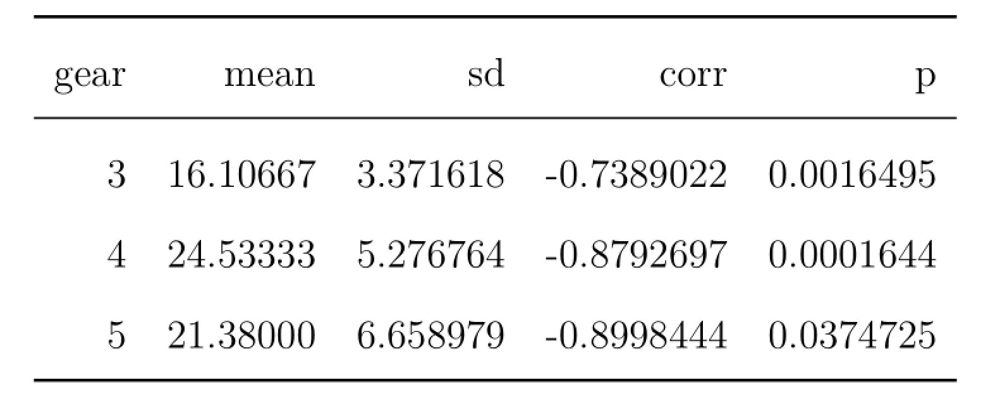
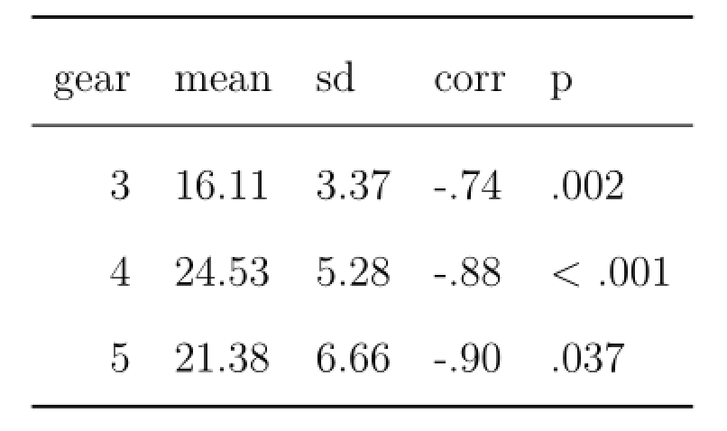
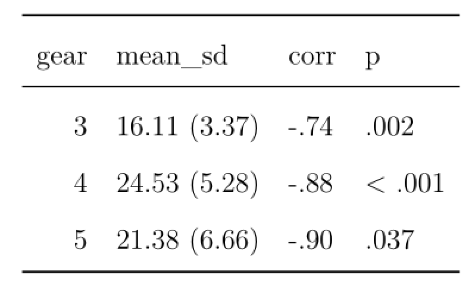
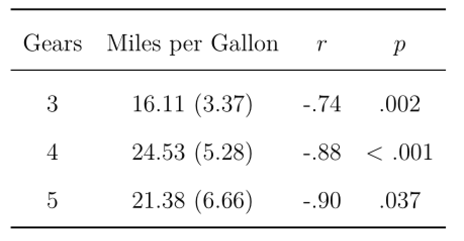
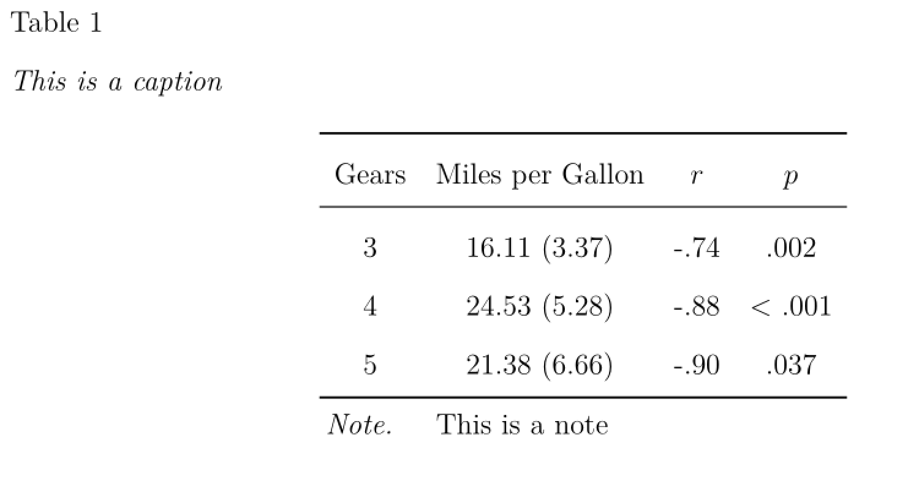
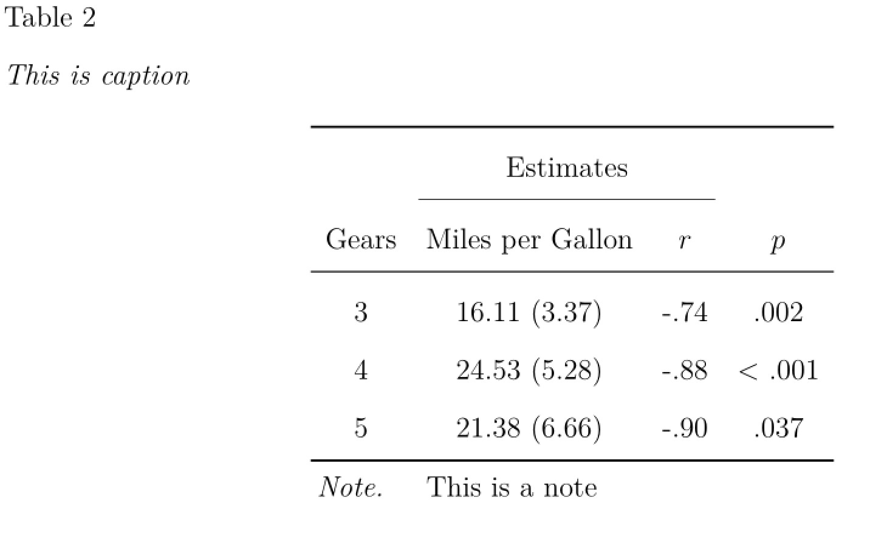
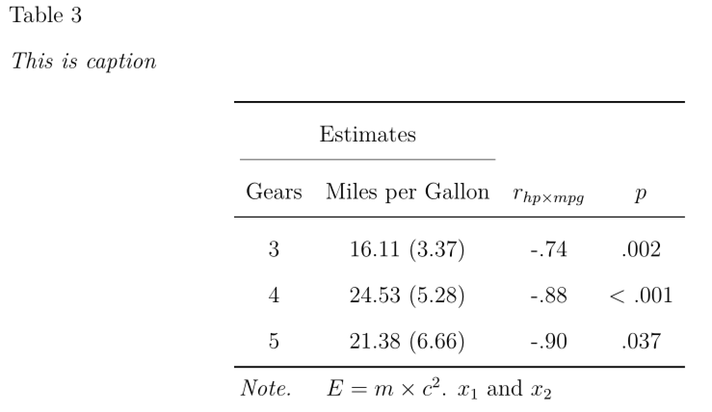
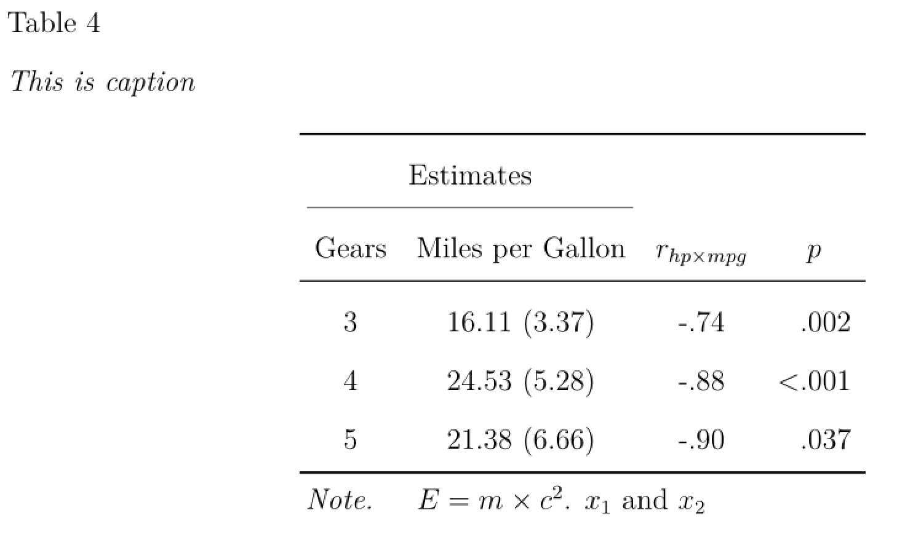

In this short tutorial, I want to demonstrate how to build publication ready `LaTeX` tables in R with the [`papaja`](https://github.com/crsh/papaja) package and the `kable()` function.


## Getting started

Before we can start, we need to install and load the packages we need for this tutorial. The `papaja` package can be installed directly from github, see the [manual](https://crsh.github.io/papaja_man/introduction.html#getting-started) for more information. 


```r
library(papaja)
library(knitr)
library(kableExtra)
library(tidyverse)
```

Lets also create an example results data.frame based on the `mtcars` data set, which we would like to convert to a nice table ready for publication. 


```r
(temp0 <- mtcars %>% 
            group_by(gear) %>% 
            summarize(mean = mean(mpg),
                      sd   = sd(mpg),
                      corr = cor.test(mpg,hp)$estimate,
                      p    = cor.test(mpg,hp)$p.value,
                      .groups="keep") %>%
            as.data.frame()) #for nicer printing
```

<div data-pagedtable="false">
  <script data-pagedtable-source type="application/json">
{"columns":[{"label":["gear"],"name":[1],"type":["dbl"],"align":["right"]},{"label":["mean"],"name":[2],"type":["dbl"],"align":["right"]},{"label":["sd"],"name":[3],"type":["dbl"],"align":["right"]},{"label":["corr"],"name":[4],"type":["dbl"],"align":["right"]},{"label":["p"],"name":[5],"type":["dbl"],"align":["right"]}],"data":[{"1":"3","2":"16.10667","3":"3.371618","4":"-0.7389022","5":"0.0016495333"},{"1":"4","2":"24.53333","3":"5.276764","4":"-0.8792697","5":"0.0001643918"},{"1":"5","2":"21.38000","3":"6.658979","4":"-0.8998444","5":"0.0374724809"}],"options":{"columns":{"min":{},"max":[10]},"rows":{"min":[10],"max":[10]},"pages":{}}}
  </script>
</div>

This data.frame `temp0` now contains the mean and standard deviation of miles per gallon, the correlation of miles per gallon and horsepower, as well as the corresponding *p*-value, for each factor level of number of gears. 

## Generate LaTeX-Table

To generate the LaTeX-Code for this data.frame, we can use the `kable()` function:


```r
kable(temp0,format = "latex",booktabs=TRUE)
```

Running this line of code in R gives us the following LaTeX-Code as output,


```r
\begin{tabular}{rrrrr}
\toprule
gear & mean & sd & corr & p\\
\midrule
3 & 16.10667 & 3.371618 & -0.7389022 & 0.0016495\\
4 & 24.53333 & 5.276764 & -0.8792697 & 0.0001644\\
5 & 21.38000 & 6.658979 & -0.8998444 & 0.0374725\\
\bottomrule
\end{tabular}
```

which leads to this table:




## Formatting the values inside the table

As a first step to improve this table, we can format the output of the values inside the table. For this we can use the functions `printnum()` and `printp()` from the `papaja` package. These functions format numerical values according to APA-Style. We can just wrap these functions around our variables and define specific properties of the variables. For instance with `gt1=FALSE`, we can indicate that the correlation variable can not have values greater than 1.


```r
(temp1 <-  temp0 %>% 
              mutate(mean = printnum(mean),
                     sd   = printnum(sd), 
                     corr = printnum(corr,gt1=FALSE),
                     p    = printp(p))  %>%
              as.data.frame())
```

<div data-pagedtable="false">
  <script data-pagedtable-source type="application/json">
{"columns":[{"label":["gear"],"name":[1],"type":["dbl"],"align":["right"]},{"label":["mean"],"name":[2],"type":["chr"],"align":["left"]},{"label":["sd"],"name":[3],"type":["chr"],"align":["left"]},{"label":["corr"],"name":[4],"type":["chr"],"align":["left"]},{"label":["p"],"name":[5],"type":["chr"],"align":["left"]}],"data":[{"1":"3","2":"16.11","3":"3.37","4":"-.74","5":".002"},{"1":"4","2":"24.53","3":"5.28","4":"-.88","5":"< .001"},{"1":"5","2":"21.38","3":"6.66","4":"-.90","5":".037"}],"options":{"columns":{"min":{},"max":[10]},"rows":{"min":[10],"max":[10]},"pages":{}}}
  </script>
</div>

When we now use this new data.frame in kable, we get the following table [I will omit the underlying LaTeX-Code from now on, but running the code in RStudio or the Console will still print the code]: 


```r
kable(temp1 ,format = "latex",booktabs=TRUE)
```


\begin{tabular}{rllll}
\toprule
gear & mean & sd & corr & p\\
\midrule
3 & 16.11 & 3.37 & -.74 & .002\\
4 & 24.53 & 5.28 & -.88 & < .001\\
5 & 21.38 & 6.66 & -.90 & .037\\
\bottomrule
\end{tabular}



This table looks already a little bit nicer than the previous one. Often we report composites of multiple descriptive statistics in one column, for instance the mean and then the standard deviation in parenthesis. We can easily implement this in R by using the `paste0()` 


```r
(temp2 <-  temp1 %>% 
              mutate(mean_sd = paste0(mean," (",sd,")"))  %>%
              select(gear,mean_sd,corr,p) )
```

<div data-pagedtable="false">
  <script data-pagedtable-source type="application/json">
{"columns":[{"label":["gear"],"name":[1],"type":["dbl"],"align":["right"]},{"label":["mean_sd"],"name":[2],"type":["chr"],"align":["left"]},{"label":["corr"],"name":[3],"type":["chr"],"align":["left"]},{"label":["p"],"name":[4],"type":["chr"],"align":["left"]}],"data":[{"1":"3","2":"16.11 (3.37)","3":"-.74","4":".002"},{"1":"4","2":"24.53 (5.28)","3":"-.88","4":"< .001"},{"1":"5","2":"21.38 (6.66)","3":"-.90","4":".037"}],"options":{"columns":{"min":{},"max":[10]},"rows":{"min":[10],"max":[10]},"pages":{}}}
  </script>
</div>

```r
kable(temp2 ,format = "latex",booktabs=TRUE)
```


\begin{tabular}{rlll}
\toprule
gear & mean\_sd & corr & p\\
\midrule
3 & 16.11 (3.37) & -.74 & .002\\
4 & 24.53 (5.28) & -.88 & < .001\\
5 & 21.38 (6.66) & -.90 & .037\\
\bottomrule
\end{tabular}



## Changing the variable namens in the table

As a next step, we could change the variable names displayed in the table and also change the alignment of the columns. While you could just change the variable names of the data.frame in R, a better solution would be to use the `kable()` function directly. With the argument `align="c"` I defined that now every column is center aligned. You can also specify a different alignment for each column by supplying a vector to `align=`. For instance `align=c("l","l","r","r","c")` would make the first two columns be left aligned, the next two columns right aligned, and the last column center aligned. In addition, I changed the column names with the `col.names` argument. Wrapping variable names between "\$\$" together with `escape    = FALSE` toggles the math-mode of LaTeX and thus makes them italic. 


```r
temp2 %>%
  kable(.,format    = "latex",booktabs=TRUE,
          align     = "c",
          col.names = c("Gears","Miles per Gallon","$r$","$p$"),
          escape    = FALSE)
```


\begin{tabular}{cccc}
\toprule
Gears & Miles per Gallon & $r$ & $p$\\
\midrule
3 & 16.11 (3.37) & -.74 & .002\\
4 & 24.53 (5.28) & -.88 & < .001\\
5 & 21.38 (6.66) & -.90 & .037\\
\bottomrule
\end{tabular}



## Adding table notes and captions

It is also straightforward to add captions and notes to a table, by again using the arguments of the `kable()`function or the `footnote()`function from the `kableExtra` package.


```r
temp2 %>%
  kable(.,format    = "latex",booktabs=TRUE,
          align     = "c",
          col.names = c("Gears","Miles per Gallon","$r$","$p$"),
          escape    = FALSE,
          caption   = "This is caption")  %>%
  footnote(general  = "This is a note",
           footnote_as_chunk = TRUE,
           threeparttable    = T,
           escape            = F,
           general_title     = "Note.",
           title_format      = c("italic"))
```

\begin{table}

\caption{\label{tab:unnamed-chunk-13}This is caption}
\centering
\begin{threeparttable}
\begin{tabular}[t]{cccc}
\toprule
Gears & Miles per Gallon & $r$ & $p$\\
\midrule
3 & 16.11 (3.37) & -.74 & .002\\
4 & 24.53 (5.28) & -.88 & < .001\\
5 & 21.38 (6.66) & -.90 & .037\\
\bottomrule
\end{tabular}
\begin{tablenotes}[para]
\item \textit{Note.} 
\item This is a note
\end{tablenotes}
\end{threeparttable}
\end{table}



## Adding interim-headers

To add more structure and details to your table, you can also use the `add_header_above()`function to add some interim-headers inside your table. For instance adding `add_header_above(c(" " = 1, "Estimates" = 2))`  creates an additional header over  the second and third variable (i.e. the two columns after the first).


```r
temp2 %>%
  kable(.,format    = "latex",booktabs=TRUE,
          align     = "c",
          col.names = c("Gears","Miles per Gallon","$r$","$p$"),
          escape    = FALSE,
          caption   = "This is caption")  %>%
  footnote(general  = "This is a note",
           footnote_as_chunk = TRUE,
           threeparttable    = T,
           escape            = F,
           general_title     = "Note.",
           title_format      = c("italic")) %>%
  add_header_above(c("Estimates" = 2))
```

\begin{table}

\caption{\label{tab:unnamed-chunk-15}This is caption}
\centering
\begin{threeparttable}
\begin{tabular}[t]{cccc}
\toprule
\multicolumn{2}{c}{Estimates} \\
\cmidrule(l{3pt}r{3pt}){1-2}
Gears & Miles per Gallon & $r$ & $p$\\
\midrule
3 & 16.11 (3.37) & -.74 & .002\\
4 & 24.53 (5.28) & -.88 & < .001\\
5 & 21.38 (6.66) & -.90 & .037\\
\bottomrule
\end{tabular}
\begin{tablenotes}[para]
\item \textit{Note.} 
\item This is a note
\end{tablenotes}
\end{threeparttable}
\end{table}



## Using additional LaTeX

It is also possible to use additional LaTeX packages and LaTeX-code in your table. For instance you can add equations and other math-options like indices. For instance, here I added an equation and some variable indexing in the note and the variable names.


```r
temp2 %>%
  kable(.,format    = "latex",booktabs=TRUE,
          align     = "c",
          col.names = c("Gears","Miles per Gallon","$r_{hp \\times mpg}$","$p$"),
          escape    = FALSE,
          caption   = "This is caption")  %>%
  footnote(general  = "$E = m \\\\times c^{2}$. $x_1$ and $x_2$",
           footnote_as_chunk = TRUE,
           threeparttable    = T,
           escape            = F,
           general_title     = "Note.",
           title_format      = c("italic")) %>%
  add_header_above(c("Estimates" = 2))
```

\begin{table}

\caption{\label{tab:unnamed-chunk-17}This is caption}
\centering
\begin{threeparttable}
\begin{tabular}[t]{cccc}
\toprule
\multicolumn{2}{c}{Estimates} \\
\cmidrule(l{3pt}r{3pt}){1-2}
Gears & Miles per Gallon & $r_{hp \times mpg}$ & $p$\\
\midrule
3 & 16.11 (3.37) & -.74 & .002\\
4 & 24.53 (5.28) & -.88 & < .001\\
5 & 21.38 (6.66) & -.90 & .037\\
\bottomrule
\end{tabular}
\begin{tablenotes}[para]
\item \textit{Note.} 
\item $E = m \times c^{2}$. $x_1$ and $x_2$
\end{tablenotes}
\end{threeparttable}
\end{table}



In addition, by adding the following line in the YAML-header of your papaja-document, you can use the more advanced column formatting options of the `siunitx` LaTeX-package. 


```r
header-includes   :
   - \usepackage{siunitx}
   - \sisetup{add-integer-zero=false}
```

Changing the `align = "c"` argument to `align     = "ccccS[table-format=< .3]"` ensure right alignemt of the *p*-value column which can include a special character (i.e., <) in some cases.


```r
temp2 %>%
  kable(.,format    = "latex",booktabs=TRUE,
          align     = "cccS[table-format=< .3]",
          col.names = c("Gears","Miles per Gallon","$r_{hp \\times mpg}$","$p$"),
          escape    = FALSE,
          caption   = "This is caption")  %>%
  footnote(general  = "$E = m \\\\times c^{2}$. $x_1$ and $x_2$",
           footnote_as_chunk = TRUE,
           threeparttable    = T,
           escape            = F,
           general_title     = "Note.",
           title_format      = c("italic")) %>%
  add_header_above(c("Estimates" = 2))
```

\begin{table}

\caption{\label{tab:unnamed-chunk-20}This is caption}
\centering
\begin{threeparttable}
\begin{tabular}[t]{cccS[table-format=< .3]cccS[table-format=< .3]cccS[table-format=< .3]cccS[table-format=< .3]}
\toprule
\multicolumn{2}{c}{Estimates} \\
\cmidrule(l{3pt}r{3pt}){1-2}
Gears & Miles per Gallon & $r_{hp \times mpg}$ & $p$\\
\midrule
3 & 16.11 (3.37) & -.74 & .002\\
4 & 24.53 (5.28) & -.88 & < .001\\
5 & 21.38 (6.66) & -.90 & .037\\
\bottomrule
\end{tabular}
\begin{tablenotes}[para]
\item \textit{Note.} 
\item $E = m \times c^{2}$. $x_1$ and $x_2$
\end{tablenotes}
\end{threeparttable}
\end{table}


